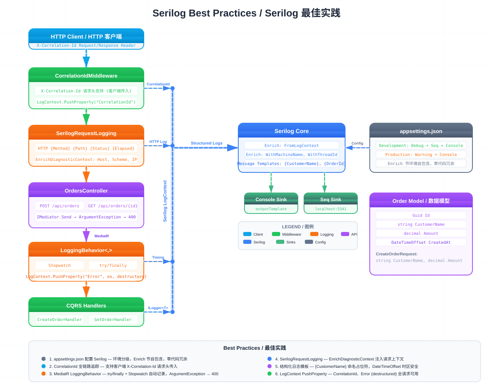

# Serilog Best Practices / Serilog 最佳实践

ASP.NET Core 10 示例项目，演示 Serilog 结构化日志的最佳实践，集成 MediatR CQRS 管道日志和 Seq 日志聚合平台。



## Tech Stack

| 技术 | 版本 | 用途 |
|------|------|------|
| .NET | 10 | Web API 框架 |
| MediatR | 14.1 | CQRS + Pipeline Behavior |
| Serilog | 10.0 | 结构化日志 |
| Seq | latest (Docker) | 日志聚合与查询 |
| Scalar | 2.14 | OpenAPI 文档 UI |

## Architecture / 架构

```
HTTP Client
    │
    ▼
CorrelationIdMiddleware ──→ LogContext.PushProperty("CorrelationId")
    │
    ▼
SerilogRequestLogging ──→ HTTP {Method} {Path} {Status} {Elapsed}
    │
    ▼
OrdersController ──→ IMediator.Send(command/query)
    │
    ▼
LoggingBehavior<,> ──→ 自动记录请求名、耗时、异常
    │
    ▼
CQRS Handlers ──→ ILogger<T> 结构化日志
    │
    ▼
Serilog ──→ Console Sink / Seq Sink (Docker)
```

### Module Table

| 模块 | 文件 | 职责 |
|------|------|------|
| CorrelationIdMiddleware | `Middleware/CorrelationIdMiddleware.cs` | 将 CorrelationId 推入 LogContext，写入响应头 `X-Correlation-Id` |
| LoggingBehavior | `Behaviors/LoggingBehavior.cs` | MediatR Pipeline Behavior，自动记录请求名称、耗时和异常 |
| OrdersController | `Controllers/OrdersController.cs` | 订单 API 控制器，委托 MediatR 处理 |
| CreateOrderHandler | `Features/Orders/CreateOrder.cs` | 创建订单 Command Handler |
| GetOrderHandler | `Features/Orders/GetOrder.cs` | 查询订单 Query Handler |
| Order | `Models/Order.cs` | 订单领域模型 |

## Quick Start

### 启动 Seq（日志聚合）

```bash
docker-compose up -d seq
```

Seq Dashboard: http://localhost:8081

### 运行应用

```bash
dotnet run --project SerilogBestPractices/SerilogBestPractices.csproj
```

应用地址: http://localhost:5018

### 构建

```bash
dotnet build SerilogBestPractices/SerilogBestPractices.csproj
```

## API Endpoints

| Method | Route | Description |
|--------|-------|-------------|
| `POST` | `/api/orders` | 创建订单 |
| `GET` | `/api/orders/{id}` | 查询订单 |

### Example Request

```bash
# 创建订单
curl -X POST http://localhost:5018/api/orders \
  -H "Content-Type: application/json" \
  -d '{"customerName":"John Doe","amount":99.9}'

# 响应头包含 X-Correlation-Id
# X-Correlation-Id: 0HNLQ5G9I3UHL:00000001
```

```bash
# 查询订单
curl http://localhost:5018/api/orders/{id}
```

## Best Practices Summary

1. **appsettings.json 配置 Serilog** — 环境分级，Development 用 Debug + Seq，Production 用 Warning + Console
2. **CorrelationId 全链路追踪** — `LogContext.PushProperty` 贯穿整个请求生命周期
3. **MediatR LoggingBehavior** — 自动记录请求名称、耗时、异常，零侵入业务代码
4. **SerilogRequestLogging** — HTTP 请求自动日志，`EnrichDiagnosticContext` 注入上下文
5. **结构化日志模板** — 使用 `{CustomerName}` 命名占位符，非字符串插值
